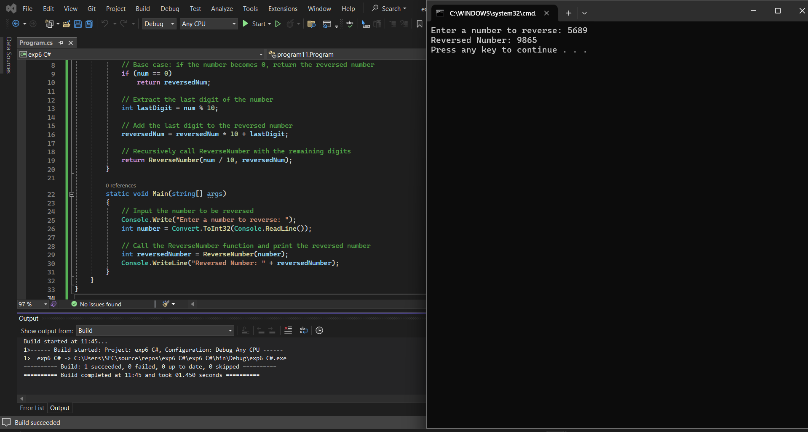

# 19AI308-Object-Oriented-Programming-using-CSharp--Ex6---Recursive-Function


# Aim: 
To write a C# program to reverse a number using recursive function.

# Algorithm:

### STEP 1 : 
Create a method (ReverseNumber) that takes an integer as input and returns its reversed form.
### STEP 2 :
 Check if the number is 0. If so, return the reversed number.
### STEP 3 :
 Use modulo operator (%) to get the last digit of the number.
### STEP 4 :
 Multiply the current reversed number by 10 and add the last digit.
### STEP 5 :
 Call the method with the remaining digits by dividing the number by 10.

# Program:
```
DEVELOPED BY : JAYABHARATHI S
REGISTER NO: 212222100013
```
```C#
using System;
namespace program11{
    class Program
    {
        static int ReverseNumber(int num, int reversedNum = 0)
        {
            // Base case: if the number becomes 0, return the reversed number
            if (num == 0)
                return reversedNum;
            
            // Extract the last digit of the number
            int lastDigit = num % 10;
            
            // Add the last digit to the reversed number
            reversedNum = reversedNum * 10 + lastDigit;
            
            // Recursively call ReverseNumber with the remaining digits
            return ReverseNumber(num / 10, reversedNum);
        }
    
        static void Main(string[] args)
        {
            // Input the number to be reversed
            Console.Write("Enter a number to reverse: ");
            int number = Convert.ToInt32(Console.ReadLine());
    
            // Call the ReverseNumber function and print the reversed number
            int reversedNumber = ReverseNumber(number);
            Console.WriteLine("Reversed Number: " + reversedNumber);
        }
    }
}
```

# Output:


# Result:
The program for reverse a number using recursion was executed successfully.
